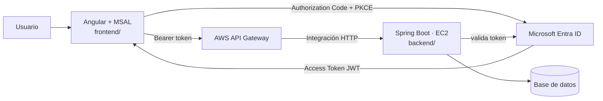

# EcoPunto · DSY1107 · Evaluación Parcial 1

**Asignatura:** DSY1107 · Desarrollo Cloud Native I · Sección 002D
**Estudiante:** Jonathan Larraguibel 

Sistema para consultar puntos limpios de reciclaje y reportar si un material ya no se puede depositar en un punto específico.

## Arquitectura



## Estado

| Componente | Estado |
|---|---|
| `frontend/` — Angular + MSAL (login, guard, interceptor) | 🟡 En desarrollo |
| `backend/` — Spring Boot Resource Server | 🟡 En desarrollo (compila y corre local con H2, falta Entra real) |
| Tenant / App Registration en Entra ID | ⏳ Pendiente |
| Despliegue en EC2 + API Gateway | ⏳ Pendiente (EP2) |

## Entidades del dominio

```text
PuntoLimpio ── Reporte
```

```text
GET  /public/puntos-limpios            → público
GET  /api/puntos-limpios               → protegido, autenticado
GET  /api/puntos-limpios/{id}/reportes → protegido, scope reportes.read
POST /api/puntos-limpios/{id}/reportes → protegido, scope reportes.write
PUT  /api/puntos-limpios/{id}          → protegido, ROLE_ENCARGADO
```

## Estructura

```text
dsy1107-ep1-ecopunto/
├── README.md
├── frontend/    ← Angular 22 + @azure/msal-angular
└── backend/     ← Spring Boot 4 · Java 21 · Resource Server OAuth2/JWT
```

## Cómo ejecutar el frontend

```bash
cd frontend
npm install
cp src/environments/environment.example.ts src/environments/environment.ts
# completar clientId, tenantId y apiScope con los valores reales del App Registration
npm start
```

## Cómo ejecutar el backend

```bash
cd backend
./mvnw spring-boot:run
```

Levanta en `http://localhost:8080` con base de datos H2 en memoria (se recrea y se
siembra con datos de prueba en cada arranque). Mientras no exista el App
Registration real en Entra ID, `issuer`/`audience`/`jwks-uri` quedan con valores
por defecto que permiten que el backend arranque, pero ningún token real va a
pasar la validación — solo sirve para probar las rutas públicas y el 401 en las
protegidas. Una vez creado el tenant, sobrescribir con variables de entorno:

```bash
export JWT_ISSUER=https://login.microsoftonline.com/<tenantId>/v2.0
export JWT_JWKS_URI=https://login.microsoftonline.com/<tenantId>/discovery/v2.0/keys
export JWT_AUDIENCE=<clientId>
```

> **Importante sobre `JWT_AUDIENCE`:** para tokens v2.0 emitidos contra la API propia
> (no Microsoft Graph), el claim `aud` viene como el Client ID "pelado" (el GUID),
> **sin** el prefijo `api://`. Si se pone `api://<clientId>` acá, la validación de
> audience falla siempre con 401 aunque el resto del token sea válido.
>
> Además, en el App Registration de Entra ID hay que forzar tokens v2 explícitamente:
> **Manifiesto → `"api": { "requestedAccessTokenVersion": 2 }`**. Por defecto queda en
> `null`, y Azure emite tokens v1.0 (`iss` con formato `https://sts.windows.net/<tenantId>/`)
> para APIs propias aunque todo el flujo de login use el endpoint v2 — es un detalle de
> compatibilidad hacia atrás con ADAL que rompe silenciosamente la validación de issuer
> si no se cambia.

## Cómo correr con Docker

Cada componente tiene su propio `Dockerfile` (build multi-stage, sin dependencias de
Maven/Node en el host más que Docker mismo).

```bash
# backend (compila con el wrapper adentro del contenedor, corre en :8080)
cd backend
docker build -t ecopunto-backend .
docker run --rm -p 8080:8080 \
  -e JWT_ISSUER=https://login.microsoftonline.com/<tenantId>/v2.0 \
  -e JWT_JWKS_URI=https://login.microsoftonline.com/<tenantId>/discovery/v2.0/keys \
  -e JWT_AUDIENCE=<clientId> \
  ecopunto-backend

# frontend (build de producción servido con nginx, corre en :80)
cd frontend
docker build -t ecopunto-frontend .
docker run --rm -p 8080:80 ecopunto-frontend
```

Si no se pasan variables de entorno al backend, arranca igual con los valores por
defecto (ver sección anterior) — útil para probar el contenedor localmente antes de
tener el tenant real.
