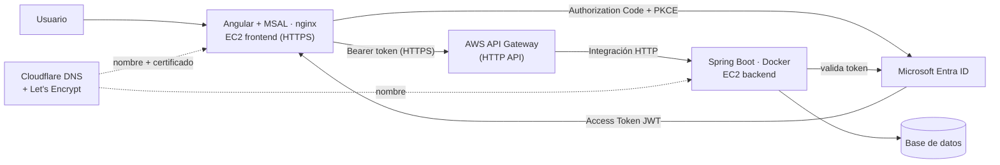

# EcoPunto · DSY1107 · Evaluaciones Parciales 1 y 2

**Asignatura:** DSY1107 · Desarrollo Cloud Native I · Sección 002D
**Estudiante:** Jonathan Larraguibel 

Sistema para consultar puntos limpios de reciclaje y reportar si un material ya no se puede depositar en un punto específico.

## Arquitectura



## Estado

| Componente | Estado |
|---|---|
| `frontend/` — Angular + MSAL (login, guard, interceptor, CRUD por rol) | ✅ Funcional, login real contra Entra ID probado |
| `backend/` — Spring Boot Resource Server | ✅ CRUD completo, valida JWT real (issuer/audience/firma/rol) |
| Tenant / App Registration en Entra ID | ✅ Configurado, login end-to-end verificado |
| Despliegue en EC2 (Docker) con dominio y HTTPS | ✅ Funcionando |
| AWS API Gateway (HTTP API) delante del backend | ✅ Funcionando, con CORS configurado |

## Entidades del dominio

```text
PuntoLimpio ── Reporte
```

```text
GET    /public/puntos-limpios            → público
GET    /api/puntos-limpios               → protegido, autenticado
POST   /api/puntos-limpios               → protegido, ROLE_ENCARGADO
PUT    /api/puntos-limpios/{id}          → protegido, ROLE_ENCARGADO
DELETE /api/puntos-limpios/{id}          → protegido, ROLE_ENCARGADO
GET    /api/puntos-limpios/{id}/reportes → protegido, scope reportes.read
POST   /api/puntos-limpios/{id}/reportes → protegido, scope reportes.write
```

## Estructura

```text
dsy1107-ep1-ecopunto/
├── README.md
├── frontend/    ← Angular 22 + @azure/msal-angular
└── backend/     ← Spring Boot 4 · Java 21 · Resource Server OAuth2/JWT
```

## Cómo ejecutar el frontend

```bash
cd frontend
npm install
cp src/environments/environment.example.ts src/environments/environment.ts
# completar clientId, tenantId y apiScope con los valores reales del App Registration
npm start
```

## Cómo ejecutar el backend

```bash
cd backend
./mvnw spring-boot:run
```

Levanta en `http://localhost:8080` con base de datos H2 en memoria (se recrea y se
siembra con datos de prueba en cada arranque). Mientras no exista el App
Registration real en Entra ID, `issuer`/`audience`/`jwks-uri` quedan con valores
por defecto que permiten que el backend arranque, pero ningún token real va a
pasar la validación — solo sirve para probar las rutas públicas y el 401 en las
protegidas. Una vez creado el tenant, sobrescribir con variables de entorno:

```bash
export JWT_ISSUER=https://login.microsoftonline.com/<tenantId>/v2.0
export JWT_JWKS_URI=https://login.microsoftonline.com/<tenantId>/discovery/v2.0/keys
export JWT_AUDIENCE=<clientId>
```

> **Importante sobre `JWT_AUDIENCE`:** para tokens v2.0 emitidos contra la API propia
> (no Microsoft Graph), el claim `aud` viene como el Client ID "pelado" (el GUID),
> **sin** el prefijo `api://`. Si se pone `api://<clientId>` acá, la validación de
> audience falla siempre con 401 aunque el resto del token sea válido.
>
> Además, en el App Registration de Entra ID hay que forzar tokens v2 explícitamente:
> **Manifiesto → `"api": { "requestedAccessTokenVersion": 2 }`**. Por defecto queda en
> `null`, y Azure emite tokens v1.0 (`iss` con formato `https://sts.windows.net/<tenantId>/`)
> para APIs propias aunque todo el flujo de login use el endpoint v2 — es un detalle de
> compatibilidad hacia atrás con ADAL que rompe silenciosamente la validación de issuer
> si no se cambia.

## Evidencia de autorización (matriz de seguridad)

Probado end-to-end contra el tenant real de Entra ID, con dos usuarios de prueba
(uno con el rol `ENCARGADO` asignado y otro sin ningún rol):

| Escenario | Resultado |
|---|---|
| `GET /public/puntos-limpios` sin token | 200 |
| `GET /api/puntos-limpios` sin token | 401 |
| `PUT`/`POST`/`DELETE /api/puntos-limpios` sin token | 401 |
| `GET /api/puntos-limpios` con token válido, sin rol `ENCARGADO` | 200 (solo exige autenticación) |
| `PUT`/`POST`/`DELETE /api/puntos-limpios` con token válido, sin rol `ENCARGADO` | 403 |
| `PUT`/`POST`/`DELETE /api/puntos-limpios` con token válido y rol `ENCARGADO` | 200/201/204 |

**Verificado también en el despliegue real de AWS** (frontend en EC2 → API Gateway →
backend en EC2, ejecutado desde el navegador con el origen real), con los mismos dos
usuarios:

| Escenario | Resultado |
|---|---|
| Público sin token / protegido sin token | 200 / 401 |
| Usuario sin rol: lectura (`GET` puntos y reportes) | 200 |
| Usuario sin rol: `POST` / `PUT` / `DELETE` | 403 |
| Usuario `ENCARGADO`: `POST` / `PUT` / `DELETE` | 201 / 200 / 204 |
| Usuario `ENCARGADO`: `DELETE` de un id inexistente | 404 |

Detalle con los claims de cada token en [`docs/evidencia/ep2-matriz-seguridad.md`](docs/evidencia/ep2-matriz-seguridad.md);
el script [`docs/evidencia/probar-matriz.js`](docs/evidencia/probar-matriz.js) permite repetir la prueba
pegándolo en la consola del navegador con una sesión iniciada.

Nota sobre permisos: los scopes delegados (`reportes.read`/`reportes.write`) se
rigen por **consentimiento** — el consentimiento de administrador otorgado una
vez en el App Registration aplica a todos los usuarios del tenant automáticamente.
El App Role (`ENCARGADO`) se rige por **asignación explícita** por usuario/grupo
en Enterprise Applications, independiente del consentimiento de scopes — por eso
un usuario sin el rol asignado igual trae los scopes en su token, pero no el rol.

## Cómo correr con Docker

Cada componente tiene su propio `Dockerfile` (build multi-stage, sin dependencias de
Maven/Node en el host más que Docker mismo).

```bash
# backend (compila con el wrapper adentro del contenedor, corre en :8080)
cd backend
docker build -t ecopunto-backend .
docker run --rm -p 8080:8080 \
  -e ALLOWED_ORIGINS=https://<dominio-frontend> \
  -e JWT_ISSUER=https://login.microsoftonline.com/<tenantId>/v2.0 \
  -e JWT_JWKS_URI=https://login.microsoftonline.com/<tenantId>/discovery/v2.0/keys \
  -e JWT_AUDIENCE=<clientId> \
  ecopunto-backend

# frontend (build de producción servido con nginx, HTTPS en :443,
# redirect automático desde :80)
cd frontend
docker build -t ecopunto-frontend .
docker run --rm -p 80:80 -p 443:443 \
  -v ~/certs:/etc/nginx/certs:ro \
  ecopunto-frontend
```

Si no se pasan variables de entorno al backend, arranca igual con los valores por
defecto (ver sección anterior) — útil para probar el contenedor localmente antes de
tener el tenant real.

## Despliegue en AWS (EP2)

```text
Navegador → https://<dominio-frontend>            (nginx en EC2, certificado Let's Encrypt)
          → https://<api-id>.execute-api.<region>.amazonaws.com   (API Gateway, HTTP API)
          → http://<dominio-backend>:8080         (Spring Boot en EC2, contenedor Docker)
```

- **Dos instancias EC2** (Amazon Linux 2023 con Docker y git): una para el frontend
  (puertos 80/443 abiertos en el Security Group) y otra para el backend (puerto 8080).
- **DNS en Cloudflare**, con dos registros `A` en modo **DNS only** (sin proxy): uno por
  cada instancia. Los certificados, el redirect URI de Entra ID, `ALLOWED_ORIGINS` y la
  integración del Gateway usan estos *nombres*, no las IPs.
- **API Gateway (HTTP API)** con una ruta `ANY /{proxy+}` y una integración HTTP hacia
  `http://<dominio-backend>:8080/{proxy}`. El CORS se configura en el Gateway (origen =
  dominio del frontend, headers `authorization` y `content-type`, métodos
  `GET, POST, PUT, DELETE, OPTIONS`). El Gateway solo enruta: la validación del JWT sigue
  siendo responsabilidad del backend.
- El `apiBaseUrl` del frontend (`src/environments/environment.ts`, no versionado) apunta a
  la URL de invocación del Gateway y queda compilado dentro del bundle, así que cambiarlo
  requiere reconstruir la imagen del frontend.

### Por qué el frontend necesita HTTPS

MSAL usa `crypto.subtle` del navegador para PKCE, y los navegadores solo exponen esa
API en un **contexto seguro**: `https://` o `http://localhost`. Servir el frontend por
HTTP plano desde una IP pública hace que MSAL falle con `crypto_nonexistent` y la app
quede en blanco, sin más error que el de la consola del navegador. Además, una página
HTTPS no puede llamar a un backend HTTP (contenido mixto): por eso el backend se expone
a través del API Gateway, que ya publica HTTPS.

### Certificado del frontend (Let's Encrypt)

Con el registro `A` del dominio apuntando a la instancia y el puerto 80 libre:

```bash
docker run --rm -p 80:80 -v /etc/letsencrypt:/etc/letsencrypt certbot/certbot certonly \
  --standalone -d <dominio-frontend> --non-interactive --agree-tos \
  --register-unsafely-without-email
mkdir -p ~/certs
sudo cp -L /etc/letsencrypt/live/<dominio-frontend>/fullchain.pem ~/certs/
sudo cp -L /etc/letsencrypt/live/<dominio-frontend>/privkey.pem ~/certs/
sudo chown $USER ~/certs/*.pem
```

El certificado se monta en el contenedor de nginx (`-v ~/certs:/etc/nginx/certs:ro`) y
no se versiona. Dura 90 días y hay que renovarlo repitiendo el comando.

### Configuración necesaria en Entra ID

En el App Registration hay que agregar `https://<dominio-frontend>` como Redirect URI de
tipo **Single-page application**, sin barra final (Azure compara el texto exacto), además
de `http://localhost:4200` para el desarrollo local; si no, el login falla con
`redirect_uri_mismatch`.

### Al reiniciar el laboratorio (AWS Academy)

Las IPs públicas cambian al detener y volver a iniciar las instancias. Como todo lo demás
usa nombres de dominio, solo hay que **actualizar los dos registros `A` en Cloudflare**
con las IPs nuevas. Los contenedores tienen `--restart unless-stopped` y arrancan solos
con la instancia.
