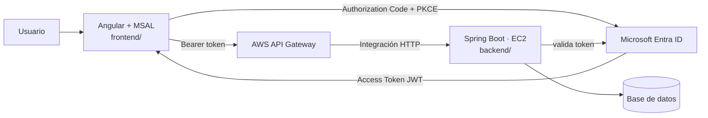

# EcoPunto · DSY1107 · Evaluación Parcial 1

**Asignatura:** DSY1107 · Desarrollo Cloud Native I · Sección 002D
**Estudiante:** Jonathan Larraguibel (trabajo individual, autorizado por el docente)
**Evaluación:** EP1 (16%) — base de este mismo proyecto continúa en EP2 (24%)

Sistema para consultar puntos limpios de reciclaje y reportar si un material ya no se puede depositar en un punto específico.

## Arquitectura



## Estado

| Componente | Estado |
|---|---|
| `frontend/` — Angular + MSAL (login, guard, interceptor) | 🟡 En desarrollo |
| `backend/` — Spring Boot Resource Server | ⏳ Pendiente |
| Tenant / App Registration en Entra ID | ⏳ Pendiente |
| Despliegue en EC2 + API Gateway | ⏳ Pendiente (EP2) |

## Entidades del dominio

```text
PuntoLimpio ── Reporte
```

```text
GET  /api/public/puntos-limpios        → público
GET  /api/puntos-limpios/{id}/reportes → protegido, scope reportes.read
POST /api/puntos-limpios/{id}/reportes → protegido, scope reportes.write
PUT  /api/puntos-limpios/{id}          → protegido, ROLE_ENCARGADO
```

## Estructura

```text
dsy1107-ep1-ecopunto/
├── README.md
├── frontend/    ← Angular 22 + @azure/msal-angular
└── backend/     ← Spring Boot (pendiente)
```

## Cómo ejecutar el frontend

```bash
cd frontend
npm install
cp src/environments/environment.example.ts src/environments/environment.ts
# completar clientId, tenantId y apiScope con los valores reales del App Registration
npm start
```
