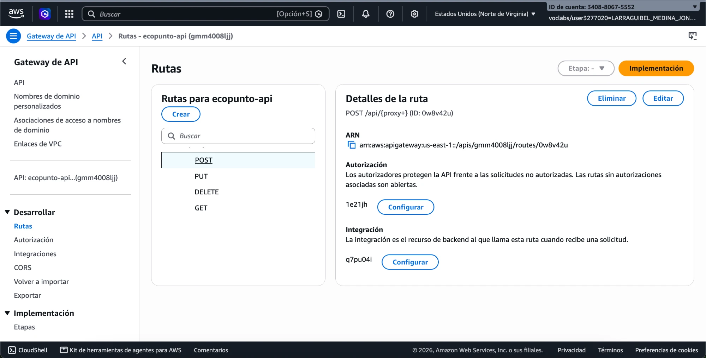
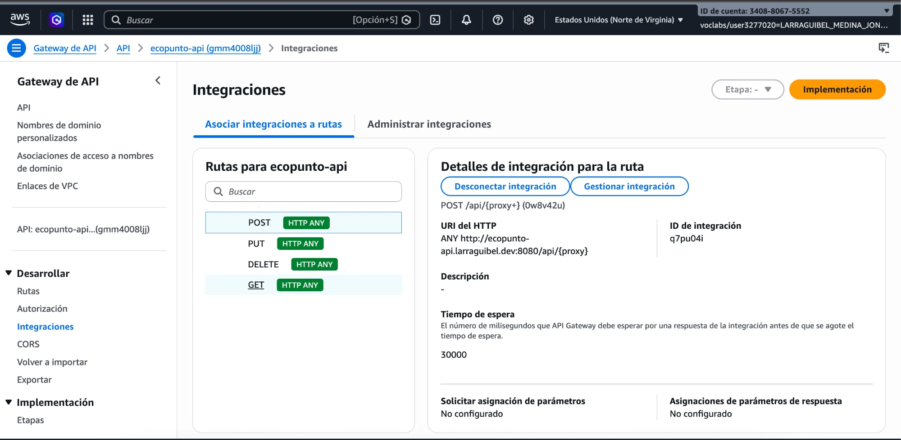
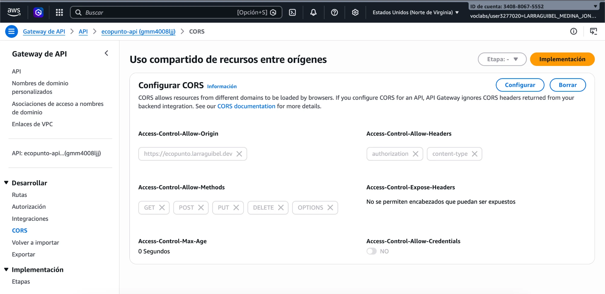
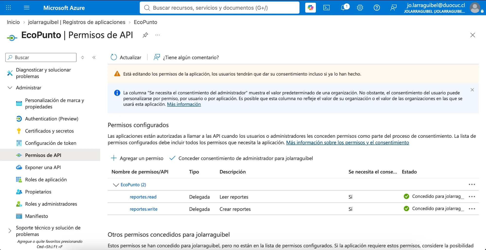
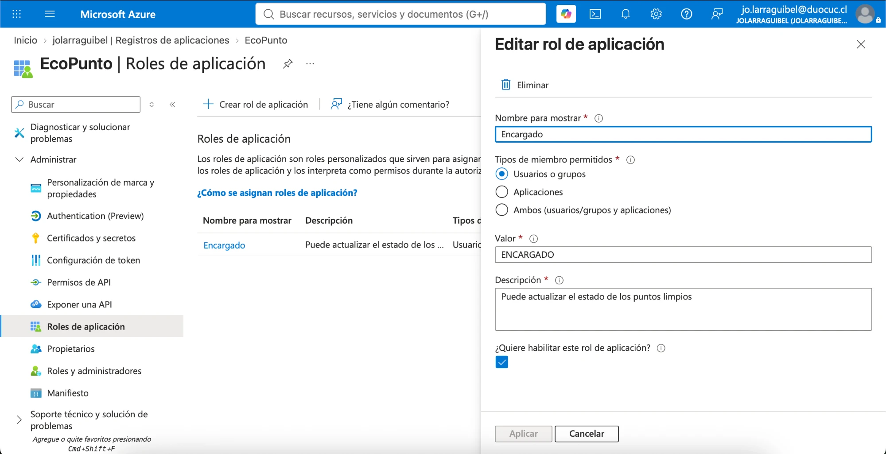
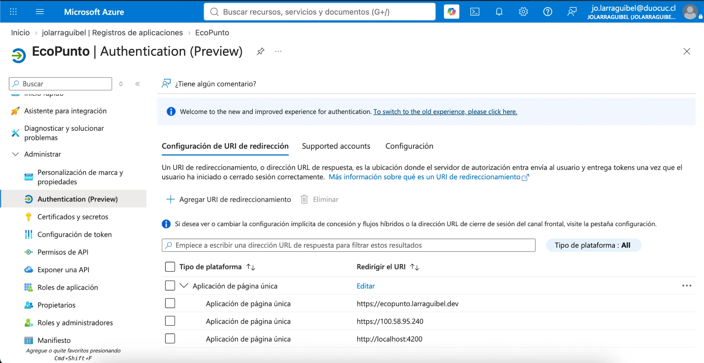
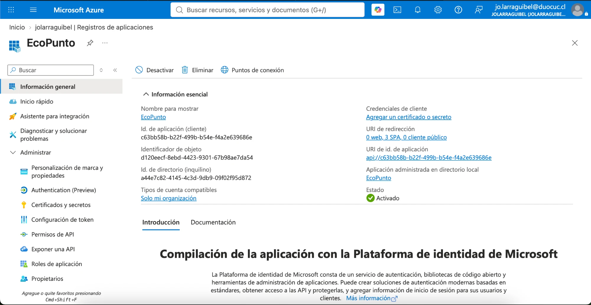

# Evidencia · Configuración en consola de AWS API Gateway y Microsoft Entra ID

Capturas de la configuración real en las dos consolas cloud, tal como la pide la pauta
oficial de EP2: creación del API Manager, rutas, JWT authorizer, CORS, tenant y App
Registration. No incluye secretos: Client ID y Tenant ID de Entra no son secretos por sí
solos (ver nota en el [README](../../README.md)), y el ID de cuenta de AWS corresponde al
laboratorio efímero de AWS Academy (`voclabs/...`), no a una cuenta productiva.

## AWS API Gateway (`ecopunto-api`, HTTP API)

### Rutas completas

Las cuatro rutas bajo `/api/{proxy+}`: `POST`, `PUT`, `DELETE`, `GET`.

### Autorización JWT en cada ruta

Las cuatro rutas usan el mismo authorizer `entra-jwt` (tipo JWT), con el issuer del
tenant y el Client ID de la API como audiencia.

### Integración con el backend

Cada ruta reenvía con `HTTP ANY` hacia `http://ecopunto-api.larraguibel.dev:8080/api/{proxy}`,
conservando el prefijo.

### CORS

Origen restringido a `https://ecopunto.larraguibel.dev`, headers `authorization` y
`content-type`, métodos `GET, POST, PUT, DELETE, OPTIONS`.

## Microsoft Entra ID (tenant `jolarraguibel`, app `EcoPunto`)

### Permisos de API con consentimiento de administrador

Los scopes `reportes.read` y `reportes.write`, ambos delegados y con consentimiento
concedido a nivel de tenant.

### App Role `ENCARGADO`

Rol de aplicación `Encargado` (valor `ENCARGADO`), asignable a usuarios o grupos,
habilitado.

### Redirect URIs (SPA)

Tres URIs de redirección registradas como SPA: el dominio de producción, una IP (resabio
de cuando se probó con certificado autofirmado antes de tener el dominio propio) y
`localhost:4200` para desarrollo local.

> Pendiente de limpieza menor: la URI `https://100.58.95.240` ya no se usa y se puede
> eliminar para dejar la lista acorde a lo que se muestra en la demo.

### App Registration

Client ID, Tenant ID y el Application ID URI (`api://<client-id>`) que expone la API del
proyecto.

## Relación con la pauta oficial de EP2

| Punto de la pauta | Evidencia |
|---|---|
| Instancia de API Manager en funcionamiento | Rutas completas |
| Configuración del API Manager que permite llamar a los endpoints | Integraciones |
| API Manager valida JWT, rechaza inválidas y acepta correctas | Autorización JWT + la matriz de [`ep2-matriz-seguridad.md`](./ep2-matriz-seguridad.md) |
| CORS configurado para el frontend | CORS |
| Tenant en IDaaS con usuarios registrados | Permisos de API + [`usuario-sin-rol.md`](./usuario-sin-rol.md) / [`usuario-encargado.md`](./usuario-encargado.md) |
| Aplicación registrada en el tenant | App Registration overview + App Role |
