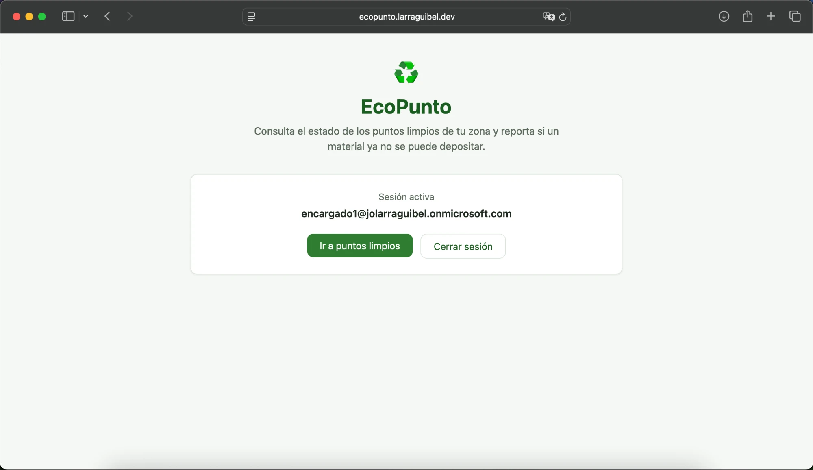
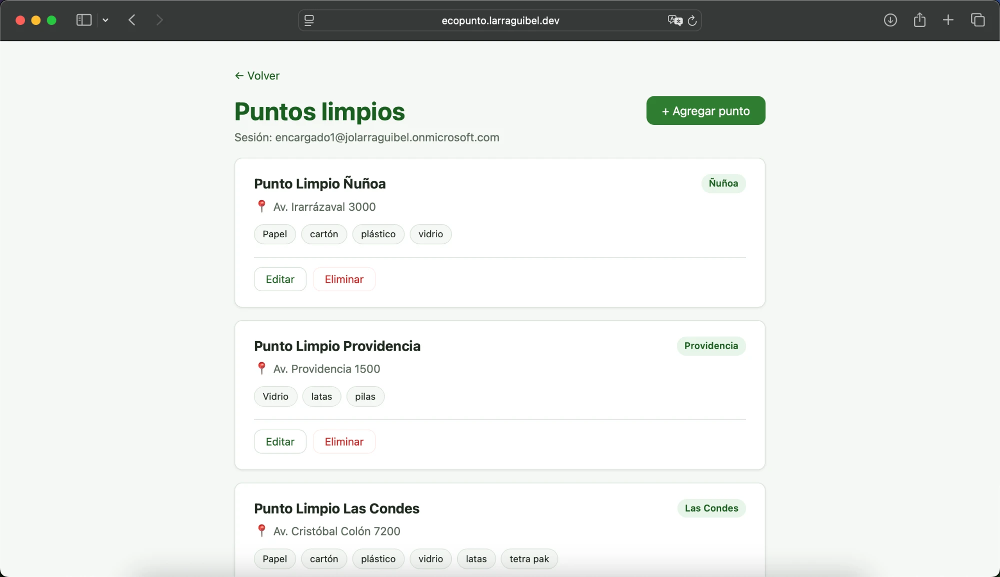
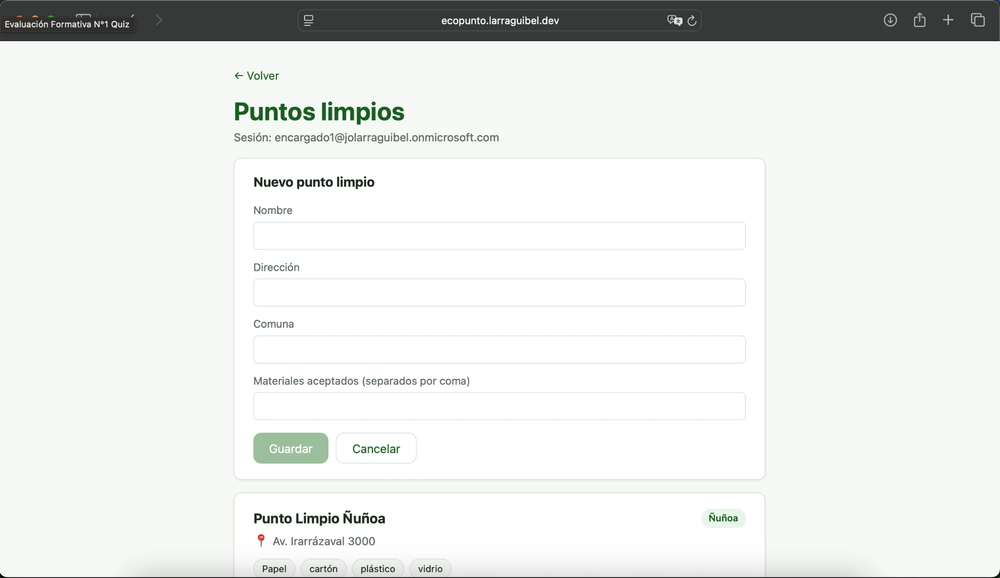
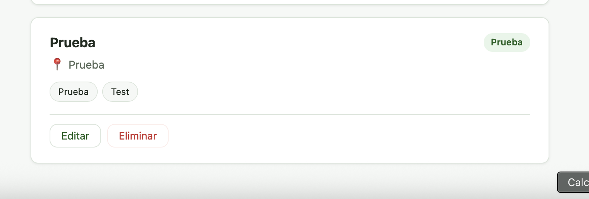
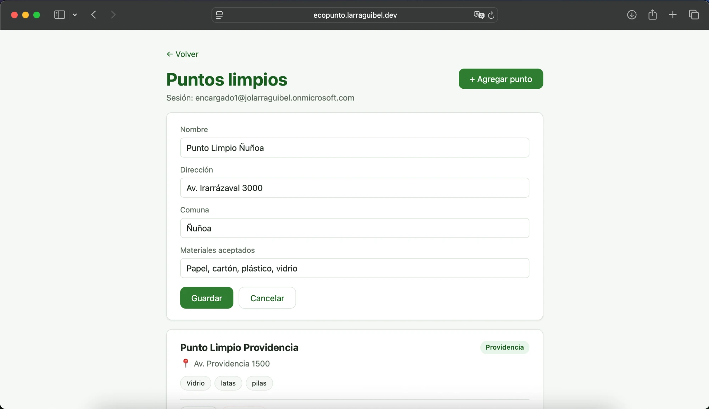
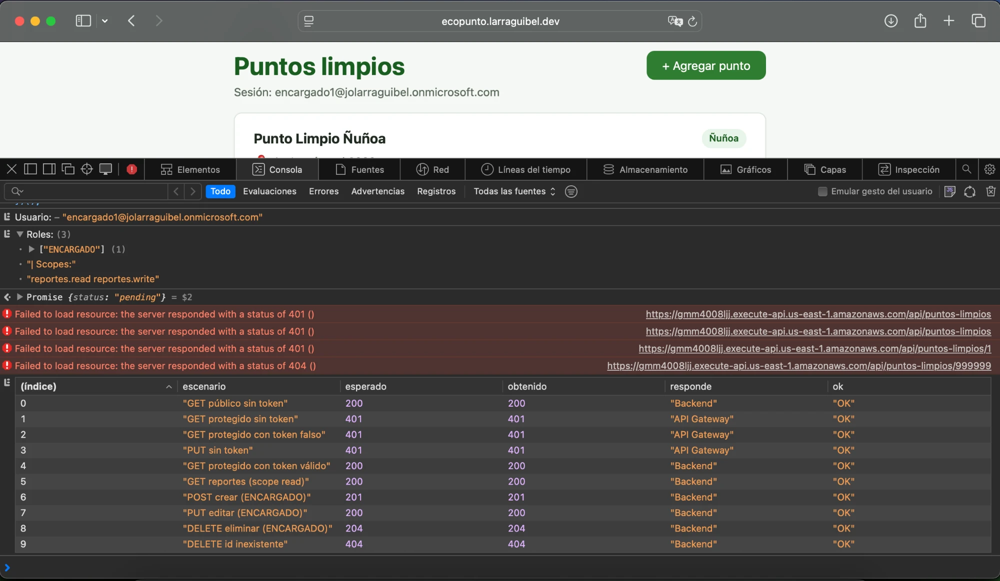

# Evidencia · Usuario con rol ENCARGADO (CRUD completo)

Evidencia visual del mismo flujo documentado en [`usuario-sin-rol.md`](./usuario-sin-rol.md),
pero con `encargado1@jolarraguibel.onmicrosoft.com` — el usuario que sí tiene el App Role
`ENCARGADO` asignado en Entra ID. Sirve de contraste directo: mismo frontend, mismo
tenant, la única diferencia es el claim `roles` del token.

## 1 · Sesión activa

El frontend confirma la sesión con el correo del token (`preferred_username`).

## 2 · Listado con controles de edición habilitados

A diferencia del usuario sin rol, acá el listado muestra los botones **Editar** /
**Eliminar** en cada tarjeta y el botón **+ Agregar punto** arriba a la derecha — el
frontend los muestra porque el claim `roles` del token incluye `ENCARGADO`.

## 3 · Crear un punto limpio (POST)

Formulario de creación, vacío, accedido desde "+ Agregar punto".

Resultado de guardar un punto de prueba — la operación `POST` se autoriza y el nuevo
punto aparece en el listado con sus propios botones Editar/Eliminar:

## 4 · Editar un punto existente (PUT)

Formulario de edición precargado con los datos actuales de "Punto Limpio Ñuñoa" —
demuestra que `PUT` también lee y modifica un recurso real, no solo el de prueba.

## 5 · Matriz completa por consola (`probar-matriz.js`)

Mismo script que en la evidencia técnica de [`ep2-matriz-seguridad.md`](./ep2-matriz-seguridad.md),
corrido con la sesión de `encargado1`. El script detecta `Roles: ["ENCARGADO"]` y, en vez
de esperar `403` en las operaciones de escritura, las ejecuta de verdad: crea un punto,
lo edita, lo elimina, y confirma `404` al intentar eliminar un id inexistente. Es
autolimpiante — no deja datos de prueba en la base.

| Escenario | Esperado | Obtenido |
|---|---:|---:|
| GET público sin token | 200 | 200 |
| GET protegido sin token | 401 | 401 |
| GET protegido con token falso | 401 | 401 |
| PUT sin token | 401 | 401 |
| GET protegido con token válido | 200 | 200 |
| GET reportes (scope read) | 200 | 200 |
| POST crear (ENCARGADO) | 201 | 201 |
| PUT editar (ENCARGADO) | 200 | 200 |
| DELETE eliminar (ENCARGADO) | 204 | 204 |
| DELETE id inexistente | 404 | 404 |

## Conclusión

Con el mismo frontend y el mismo backend, el único factor que cambia el resultado de
`POST`/`PUT`/`DELETE` (403 vs. 2xx) es el claim `roles` del token — confirmado tanto
desde la UI (botones habilitados, formularios funcionales) como desde la API directa
(matriz por consola).
