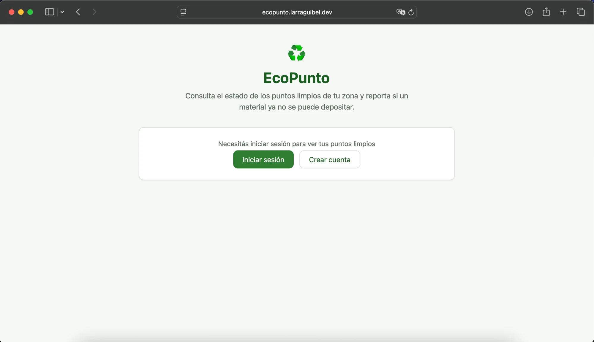
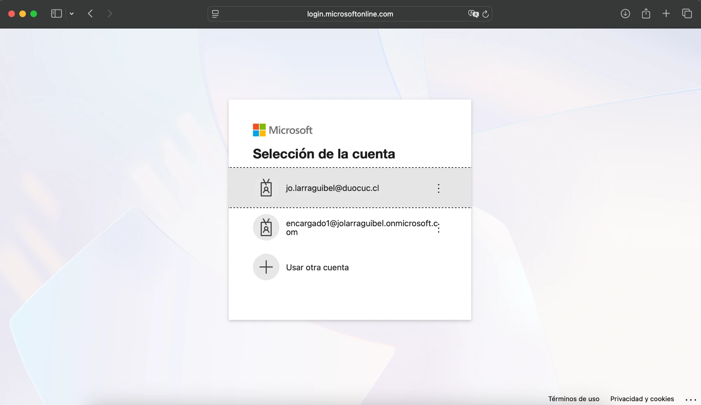
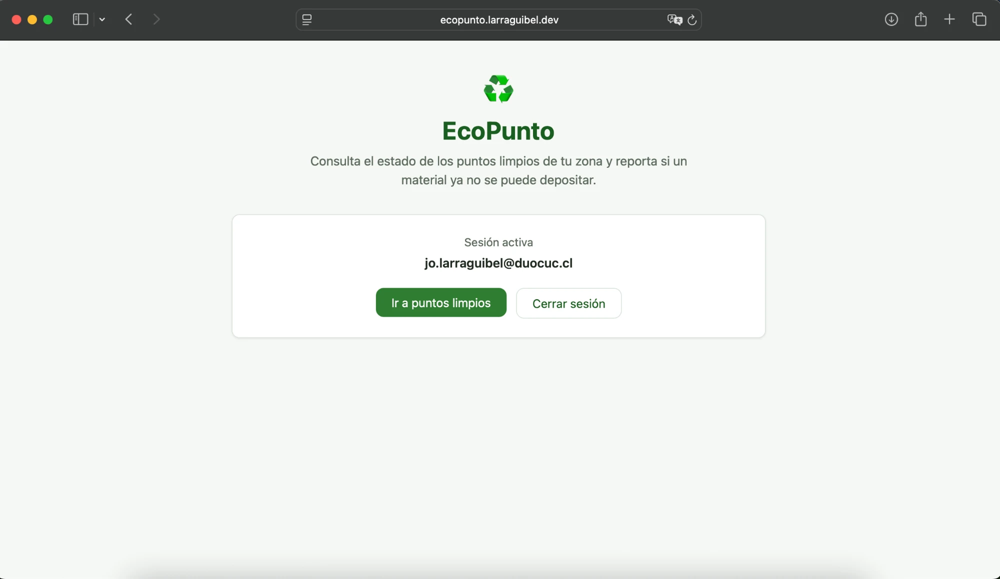
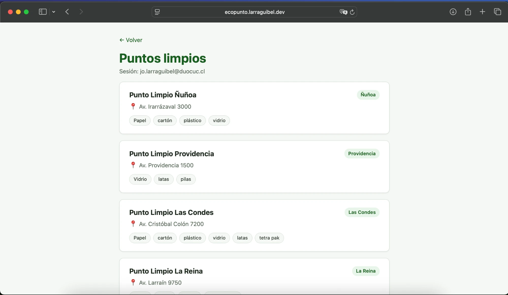

# Evidencia · Registro y comportamiento de un usuario sin rol

Evidencia visual del flujo de autoservicio (crear cuenta → iniciar sesión) y de cómo se
comporta la aplicación para un usuario autenticado que **no** tiene el rol `ENCARGADO`
asignado. Complementa la matriz técnica de [`ep2-matriz-seguridad.md`](./ep2-matriz-seguridad.md),
que prueba lo mismo a nivel de API (401/403); acá se muestra el mismo caso desde la UI.

## Usuario de la evidencia

`jo.larraguibel@duocuc.cl` — cuenta creada con el flujo de autoservicio ("Crear cuenta")
del propio frontend, sin rol asignado en Entra ID. Mismo usuario que aparece con
`Roles: (ninguno)` en la consola al correr [`probar-matriz.js`](./probar-matriz.js).

## 1 · Pantalla inicial sin sesión

Estado por defecto de `https://ecopunto.larraguibel.dev`: sin sesión activa, con las
opciones **Iniciar sesión** y **Crear cuenta** (flujo de autoservicio de Entra ID vía
MSAL, `prompt=create`).

## 2 · Selector de cuenta de Microsoft

Al iniciar sesión, Entra ID muestra las cuentas ya usadas en este navegador: se ve
`jo.larraguibel@duocuc.cl` (sin rol) y `encargado1@jolarraguibel.onmicrosoft.com` (con
rol `ENCARGADO`) — dos identidades reales y distintas dentro del mismo tenant.

## 3 · Sesión activa sin rol

Tras autenticarse como `jo.larraguibel@duocuc.cl`, el frontend confirma la sesión con el
correo del token (claim `preferred_username`).

## 4 · Listado de puntos limpios sin controles de edición

Con este mismo usuario, el listado de puntos limpios se ve solo en modo lectura: no
aparecen los botones de crear, editar ni eliminar, porque el frontend los oculta cuando
el claim `roles` del token no incluye `ENCARGADO`.

> Ocultar los botones es solo una ayuda de UX, no la protección real: la matriz en
> [`ep2-matriz-seguridad.md`](./ep2-matriz-seguridad.md) prueba que este mismo usuario
> recibe **403** del backend si intenta `POST`/`PUT`/`DELETE` llamando directo a la API
> desde la consola, aunque los botones estuvieran visibles.
